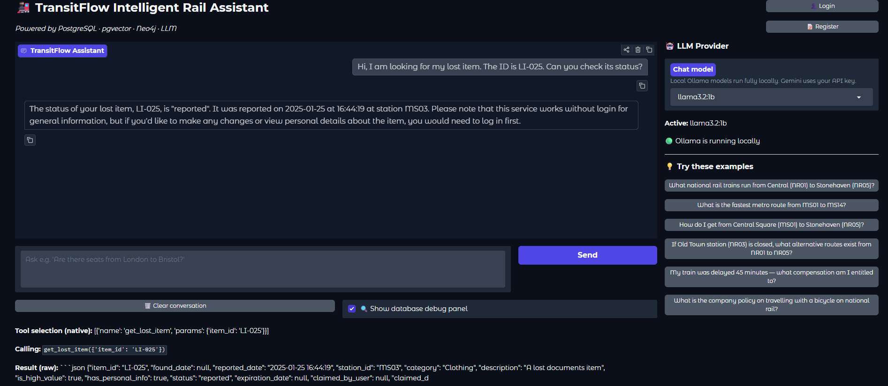
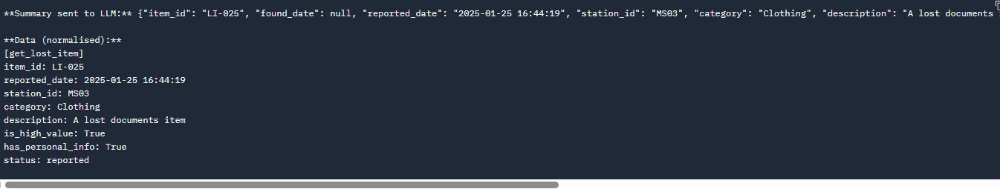
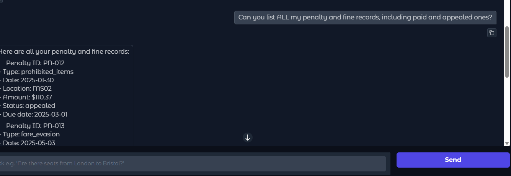
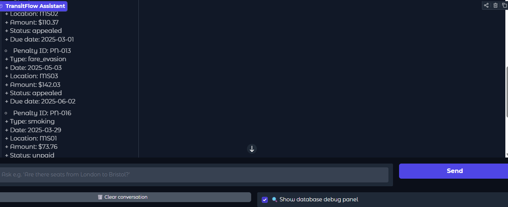
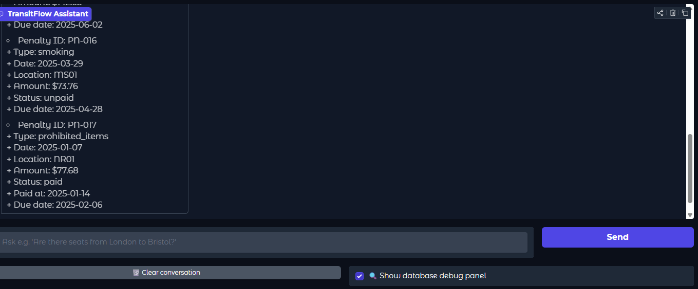
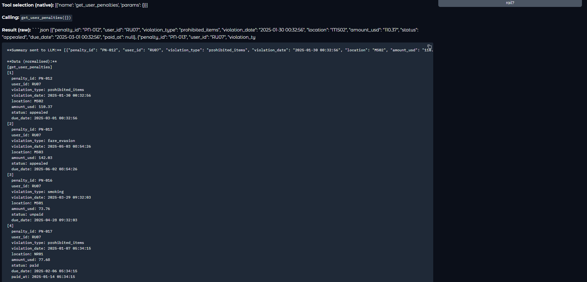

# Section 1 — Entity-Relational Diagram

.png>)

# Section 2 — Normalisation Justification (正規化與設計決策)

## 2.1 正規化設計決策 (符合 3NF)

在我們的資料庫設計中，我們刻意在 `national_rail_bookings`（台鐵訂單）與 `metro_travel_history`（捷運乘車紀錄）表格中落實第三正規化 (3NF)。

- 設計決策：雖然訂單表中儲存了起站與迄站的 ID (`origin_station_id`, `destination_station_id`)，但不將「車站名稱」儲存在訂單表中。
- 理論基礎與相依性：此決策基於 Functional Dependency 原則。在 `metro_stations` 表格中，車站名稱功能相依於候選鍵 `station_id`。
- 達成 3NF 的理由：若將車站名稱直接存於訂單表中，將產生 Transitive Dependency，例如 `booking_id → origin_station_id → 車站名稱`。透過將車站名稱移除、僅保留在 stations 表格中，我們消除了資料重複性，並有效防止更新異常 (Update Anomaly)。

## 2.2 反正規化設計取捨 (De-normalisation Trade-off)

儘管系統已高度正規化，我們仍針對訂單表與乘車紀錄表中的 `amount_usd`（結帳金額）欄位採取反正規化設計。

- 設計決策：在購票當下系統即計算出最終的 `amount_usd` 並直接儲存於訂單紀錄中，而非每次查詢時透過 JOIN `national_rail_fares` 動態計算。
- 效能與一致性考量：
  - 歷史資料一致性：票價會隨時間變動，若完全依賴 JOIN 動態計算，過去歷史訂單的顯示金額可能會因票價調整而錯誤。
  - 系統效能提升：預先儲存結帳金額可免去財務稽核時高昂的多表聚合查詢成本，顯著提升讀取效能。

## 2.3 密碼雜湊與安全性設計 (Password Hashing)

針對 `users_confidential`（機密資料）表格，系統嚴禁儲存明碼密碼，並採用 Argon2id 演算法進行密碼雜湊處理。

- 演算法選擇：
  - MD5 / SHA-1 適合快速摘要，但易受到現代 GPU 暴力破解攻擊。
  - Argon2id 是記憶體密集型演算法，具備可配置的運算成本因子 (Cost factor) 與密鑰延展 (Key stretching)，可有效提高破解成本。
- 鹽值 (Salt) 管理：
  - 在雜湊前，為每位使用者的密碼附加獨立且隨機的 Salt。
  - 這可防禦彩虹表攻擊 (Rainbow-table attacks)。
- 實例說明：
  - 若用戶 A 與用戶 B 使用相同弱密碼 `P@ssw0rd123`，沒有 Salt 時會產生相同雜湊值。
  - 加入獨立 Salt 後，`Hash("P@ssw0rd123" + Salt_A)` 與 `Hash("P@ssw0rd123" + Salt_B)` 會得到不同結果，即使密碼相同。

# Section 3 — Graph Database Design Rationale

## Criterion 1: Nodes, Relationships, and Properties

### Nodes

- 節點存放站點實體。
- 使用 `Station` 作為基礎標籤，並依網路種類加上 `MetroStation` 或 `NationalRailStation` 標籤。
- 理由：車站是圖形資料庫中的點。多重標籤可在全域路徑搜尋時統一查詢 `Station`，也可快速過濾特定網路。

### Relationships

- 關聯描述車站之間的連接與可達性。
- 設計三種關聯類型：`METRO_LINK`、`RAIL_LINK`、`INTERCHANGE_TO`。
- 理由：將實際軌道與轉乘通道轉換為圖中的邊。區分類型方便演算法根據連線類別做網路隔離。

### Properties

- 節點屬性包含：`station_id`, `name`, `network`, `lines`。
- 邊屬性包含：`travel_time_min`, `fare`, `fare_first`。
- 理由：將「時間」與「票價」放在關聯上，可直接作為 Dijkstra 或其他最短路徑演算法的權重，簡化查詢邏輯。

## Criterion 2: Why Graph Database for Routing

- 在關聯式資料庫中實作路徑搜尋需要遞迴 CTE，且每前進一站都要進行 JOIN。
- 隨著路徑長度增加，運算負擔與記憶體消耗會迅速上升。
- 圖形資料庫可直接使用 APOC 的 `apoc.algo.dijkstra`，在記憶體中遍歷相鄰節點，路徑搜尋時間複雜度較低，效能不會因跳數增加而大幅下降。

## Criterion 3: Query Types Enabled by Graph Model

### 查詢類型 1：最低票價路徑 (Cheapest Route)

- `query_cheapest_route` 函數允許使用者尋找兩站之間的最省錢路徑，並可動態切換票價等級。
- 模型支援方式：票價已預先計算並儲存在關聯屬性上，Cypher 查詢可直接將動態變數傳遞給 Dijkstra 演算法。

### 查詢類型 2：跨網轉乘路徑 (Cross-Network Interchange Path)

- `query_interchange_path` 函數可尋找捷運換台鐵或台鐵換捷運的路線。
- 模型支援方式：圖模型適合變長路徑查詢。例如使用 `MATCH path = (start)-[:METRO_LINK|RAIL_LINK|INTERCHANGE_TO*1..15]-(end)`，並透過 `WHERE ANY(r IN relationships(path) WHERE type(r) = 'INTERCHANGE_TO')` 過濾跨網轉乘路徑。

## Criterion 4: Node Identity

- 唯一識別屬性：`station_id`。
- 理由：
  - 車站代碼（如 `MS01`, `NR05`）不會隨意變動，適合作為唯一主鍵。
  - 車站名稱可能重複或未來改名，不適合作為唯一識別。
- 查詢效能優化：在 Neo4j 建立 `UNIQUE` Constraint 時，會同時建立索引。所有路徑查詢如 `MATCH (start:Station {station_id: $origin_id})`，可利用此索引快速定位起點與終點，提升查詢效能。

# Section 4 — Vector / RAG Design

## Criterion 1: What is Embedded & Why Cosine Similarity

### What is Embedded

- 我們將以下非結構化文件嵌入向量資料庫：
  - `booking_rules.json`
  - `penalty_fares.json`
  - `travel_policies.json`
  - `refund_policy.json`
- 這樣可讓 AI 理解並精準引用這些政策文件。

### Why Cosine Similarity is Appropriate

- Cosine Similarity 只計算向量之間的夾角 `cos θ`，忽略長度差異。
- 它具備長度獨立性 (magnitude-independent)，更專注於向量方向的相似度，而非文本長度。

## Criterion 2: The Full RAG Pipeline

1. **查詢嵌入 (Query Embedding)**
   - 使用者提出問題後，LLM 將問題轉換為向量表示。
2. **相似度搜尋 (Similarity Search)**
   - 將查詢向量傳遞給向量資料庫，計算與政策文件向量的餘弦相似度，並篩選出最相關的段落。
3. **處理檢索出的文件 (Retrieved Documents)**
   - 對檢索結果進行結構化與截斷，避免無用雜訊或過長文本擠爆 LLM 的上下文視窗。
4. **提示詞組裝與生成回答 (LLM Prompt to Answer)**
   - 將處理好的文件轉換為純文字，再傳給模型生成基於事實的答案。

## Criterion 3: Embedding Dimension & Provider Switch Consequence

1. **系統實作的實際維度**
   - 我們使用 Ollama 作為嵌入模型提供商，使用 nomic-embed-text 模型，因此，存入 `pgvector` 的向量維度為 `768`。
2. **供應商切換風險**
   - 若完成 Seeding 後切換供應商，可能發生維度不匹配錯誤，導致 RAG 系統無法運作。
   - 不同供應商的嵌入向量維度各不相同，例如 Ollama 是 `768`，而 Gemini 可能是 `3072`。
   - 若資料庫已存入 `768` 維向量，卻使用 `3072` 維查詢向量計算餘弦相似度，會造成數學與型別錯誤，查詢無法執行。

## Criterion 4: Scalability & Production Trade-offs (規模化與生產環境取捨)

目前的 RAG 實作針對百萬向量級別以下的輕量級政策文件能良好運作，但若要擴展至超大型生產環境，就現況來說不敷使用，很可能炸掉，透過老師提供的文件，我們學到系統還需要以下架構升級：

1. **分塊 (Chunking)**：目前政策文件是整份轉換為向量。若要擴展環境，應實作 Fixed-size 或 Semantic Chunking（例如每 300-500 Tokens 切塊），以提升大篇幅文件（如 Booking Rules）的相似度檢索精準性。
2. **詮釋資料過濾 (Metadata Filtering)**：目前的查詢主要依賴純粹的向量距離 (`<=>`)。針對跨部門文件，未來應先在 SQL 加入 `WHERE category = '...'` 作為硬性前置過濾，再進行餘弦相似度比對，避免跨類別的雜訊干擾。
3. **快取 (Embedding Cache)**：目前相同問題會重複觸發 LLM API，未來應在系統層引入 `lru_cache` 或 Redis 快取熱門查詢的 Embedding 向量，以大幅降低 API 延遲與呼叫成本。

# Section 5 — AI Tool Usage Evidence

## 範例一: 圖形資料庫匯入檢查(Schema Design)

- **Context**：在大眾運輸路網圖形資料庫專案中，我寫了 `seed_neo4j.py`，將捷運與國鐵車站 JSON 原始資料匯入 Neo4j。
- **Prompt**：請檢查 `seed_neo4j.py` 是否漏掉 JSON 資料中的關鍵欄位或轉乘關聯。
- **Outcome**：AI 回覆程式碼未漏掉任何關鍵資料，並建議刪除不必要的 `Fallback Pairs` 部分。

## 範例二: 圖形資料庫概念釐清(Design Rationale)

- **Context**：專案初期，我請 AI 協助了解圖形資料庫的核心概念與優勢。
- **Prompt**：請詳細解釋圖形資料庫的核心組成要素，並對比傳統關聯式資料庫。
- **Outcome**：AI 說明圖形資料庫是基於圖論的 NoSQL，核心結構為節點（Nodes）、邊（Edges）、屬性（Properties）。它比較傳統 RDBMS 依賴 JOIN，而圖形資料庫透過指標遍歷，查詢時間更依賴於走訪節點數，而非總資料量。

## 範例三: 因 Prompt 沒交代預設值，導致出現 NULL 異常 (Schema Design)

- **Context**：在設計 schema.sql 時，我需要為 users (會員) 資料表加入「註冊時間」的欄位。
- **Prompt**：請幫我在 users 資料表中新增一個儲存註冊時間的欄位。
- **Outcome**：因為我提問時沒有交代預設邏輯，AI 僅給出了最基本的 registration_date TIMESTAMP。在後續執行 Python 腳本新增測試會員時，我發現如果我沒有在程式碼裡手動指定時間，這個欄位就會變成 NULL (空值)。我意識到這在系統設計上很危險。因此，我拒絕了 AI 的寫法，自己將語法修改為 registration_date TIMESTAMP DEFAULT CURRENT_TIMESTAMP，讓資料庫在建立新會員時，能自動且精準地填入當下的系統時間。

## 範例四: Schema 設計的複合主鍵防呆 (Schema Design)

- **Context**：在設計 schema.sql 時，我正在處理捷運班表與停靠站的中介表 metro_schedule_stops。
- **Prompt**：在 SQL 中，我要怎麼確保同一個 schedule_id (班次) 絕對不會重複停靠同一個 station_id (車站)？
- **Outcome**：AI 建議我不要使用傳統的 SERIAL 作為主鍵，而是將 (schedule_id, station_id) 設定為「複合主鍵 (Composite Primary Key)」。我將這個建議實作進我的程式碼中，這讓資料庫能在底層直接阻擋重複寫入的髒資料，大幅提升了資料完整性。

# Section 6 — Reflection & Trade-offs (系統反思與設計取捨)

## 6.1 具體設計決策與考量 (Design Decisions)

### 決策一：中繼表採用複合主鍵 (Composite Primary Keys)

- 應用表格：`metro_schedule_stops`, `national_rail_schedule_stops`
- 考量：放棄自動遞增 ID，改以 `(schedule_id, station_id)` 作為複合主鍵。
- 目的：確保資料完整性，避免同一交通班次出現重複停靠站。
- 優勢：藉由資料庫層級唯一性約束防止髒資料，比分散在應用層的檢查更可靠。

### 決策二：以客製化 VARCHAR 取代 SERIAL 與 UUID

- 應用表格：`users`（會員主鍵）
- 考量：
  - 捨棄 SERIAL：連續數字易遭 IDOR 攻擊，且易與其他流水號混淆。
  - 捨棄 UUID：雖然安全，但 36 字元較不易讀，客服溝通成本高，且可能引發 B-Tree 索引膨脹 (Index Bloat)。
- 採用 `varchar(50)`：允許帶前綴的短英數編號（如 `MTR-A8492`），兼顧可讀性與效能，降低索引膨脹風險。

## 6.2 正式環境差異考量 (Production System Differences)

- 生產環境隱憂：未導入資料庫連線池 (Connection Pooling) 會導致資源耗盡。
- 現狀與痛點：開發階段直接與資料庫建立連線，面對尖峰高併發時，PostgreSQL 直連會迅速耗盡記憶體並觸發最大連線數限制，導致資料庫癱瘓。
- 上線架構建議：正式環境必須引入 Connection Pooler（例如 PgBouncer），透過預先建立固定連線池，讓大量短暫請求共用底層連線，維持高負載下的穩定性。

# Section 7 — Optional Extension Bonus (Task 6)

## 7.1 擴充功能名稱

**遺失物與使用者違規罰款追蹤系統 (Lost Items & Penalties System)**

## 7.2 動機 (Motivation)

在真實的大眾運輸系統中，旅客遺失物品與逃票/違規行為是客服處理的兩宗不小的業務。現有的資料庫模型僅涵蓋了基本的購票與乘車行為，缺乏部分超脫正常營運狀況的管理能力。
透過引入 `lost_items` (遺失物) 與 `penalties` (罰金) 兩張資料表，並為它們設計專屬的狀態機 (Status Enum)，我們不僅能讓系統模擬更真實的營運場景，也大幅擴充 AI Agent 的服務範圍，現在的 AI 也可以直接幫助使用者查詢遺失物進度，或提醒使用者繳納未繳清的罰款，為系統帶來實質的營運價值。

## 7.3 變更說明與設計決策 (Change Description & Rationale)

### Schema 變更範例

我們在 `databases/relational/schema.sql` 中新增了資料表與列舉型別：

```sql
-- 透過 ENUM 嚴格控管狀態，防止無效字串寫入
CREATE TYPE lost_item_status AS ENUM (
    'reported', 'found', 'claimed', 'police', 'donated', 'destroyed', 'love_umbrella'
);

-- is_high_value 用於標記高價值物品（如錢包、手機），便於後續與一般物品（如雨傘）做分流處理
CREATE TABLE IF NOT EXISTS lost_items (
    item_id VARCHAR(20) PRIMARY KEY,
    reported_date TIMESTAMP WITH TIME ZONE DEFAULT CURRENT_TIMESTAMP,
    station_id VARCHAR(10) NOT NULL,
    category VARCHAR(50) NOT NULL,
    description TEXT,
    is_high_value BOOLEAN DEFAULT FALSE,
    status lost_item_status DEFAULT 'reported',
    found_date TIMESTAMP WITH TIME ZONE,
    claimed_date TIMESTAMP WITH TIME ZONE,
    claimed_by_user VARCHAR(50) REFERENCES users(user_id) ON DELETE RESTRICT
);
```

### 設計決策與防呆機制

1. **罰款與使用者的關聯 (Penalties User Association)**：我們刻意將 `penalties` 直接與 `users.user_id` 綁定，而非與訂單 `booking_id` 綁定。原因是逃票行為發生時，違規者通常「沒有」訂單紀錄。
2. **狀態安全更新 (Atomic Updates)**：在 `execute_pay_penalty` 中，我們強制使用 `AND status = 'unpaid'` 作為更新條件，避免 race condition 導致已繳費的罰單被重複扣款。
3. **過濾器優化 (Optimised Filtering)**：在 `query_user_penalties` 中，我們預設以 `violation_date DESC` 排序，讓最新或未繳款的罰單永遠優先呈現給 AI 與使用者。

## 7.4 測試證據 (Testing Evidence)

功能已成功整合至 Gradio UI 聊天機器人中，並且成功運作。
您可以直接在 UI 中輸入以下範例指令來測試擴充功能：

- **查詢遺失物**: `I lost my umbrella, my item id is LI-025. Can you check its status?`
  - 背後運作：AI 會呼叫 get_lost_item。
  - 預期正確解答：AI 應該會回答：「這件物品 (Clothing/Documents) 是在 2025 年 1 月 25 日於 MS03 車站申報遺失的，目前狀態仍然是 'reported' (尚未尋獲)。」




- **查詢個人罰款**: `Can you list ALL my penalty and fine records, including paid and appealed ones?`
  - 前置動作：請先在左側面板登入帳號 `grace.lee@email.com` (密碼: grace1225)。
  - 背後運作：AI 會呼叫 get_user_penalties。
  - 預期正確解答：AI 會條列出資料庫回傳的 4 筆紀錄，回應內容大意如下：「You have a total of 4 penalty records: 1. PN-016 (Smoking at MS01) - $73.76 (Status: unpaid). 2. PN-012 (Prohibited Items at MS02) - $110.37 (Status: appealed). 3. PN-013 (Fare Evasion at MS03) - $142.03 (Status: appealed). 4. PN-017 (Prohibited Items at NR01) - $77.68 (Status: paid).」





